<h1 align="center">Novi — Android Meets Mac</h1>

  

  <strong>Your Android phone, now part of your Mac experience.</strong> 
  Notifications, files, clipboard, and device controls—connected directly over your local network.

  
  &nbsp;
  

<em>Coming soon.</em>

  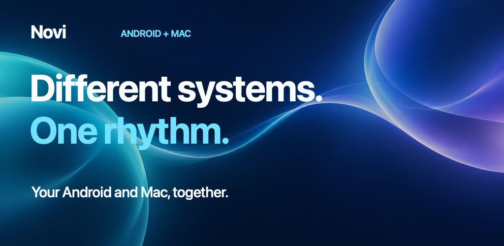

## Two systems. One flow.

Novi creates the Android–Mac ecosystem that has always been missing. Pair your devices once, keep your phone nearby, and handle everyday interruptions without leaving your Mac.

- See Android notifications on macOS as they arrive.
- Reply, dismiss, or open supported notifications on your phone.
- Move files and clipboard text between devices.
- Ring, vibrate, or silence your Android phone from your Mac.
- Build smart, on-device routines around notifications and device state.

No Novi account. No cloud relay. No advertising or analytics backend.

<table>
  <tr>
    <td width="50%">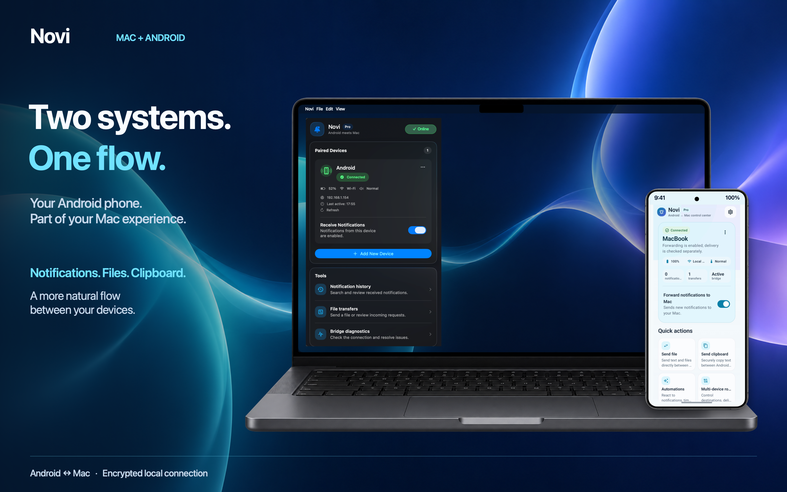</td>
    <td width="50%">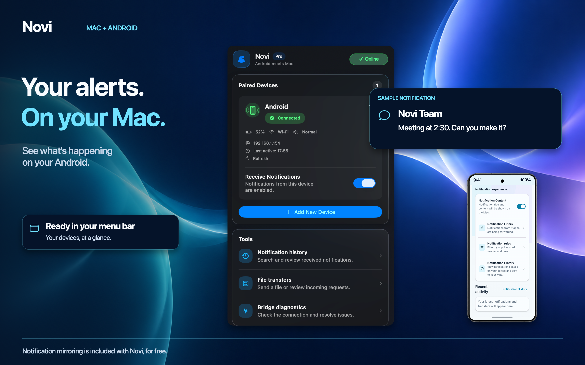</td>
  </tr>
</table>

## Notifications that meet you where you work

Receive Android notifications in the native macOS experience. When the originating Android app supports an action, Novi lets you reply, dismiss the notification, or open it on your phone—without breaking your flow.

<table>
  <tr>
    <td width="50%">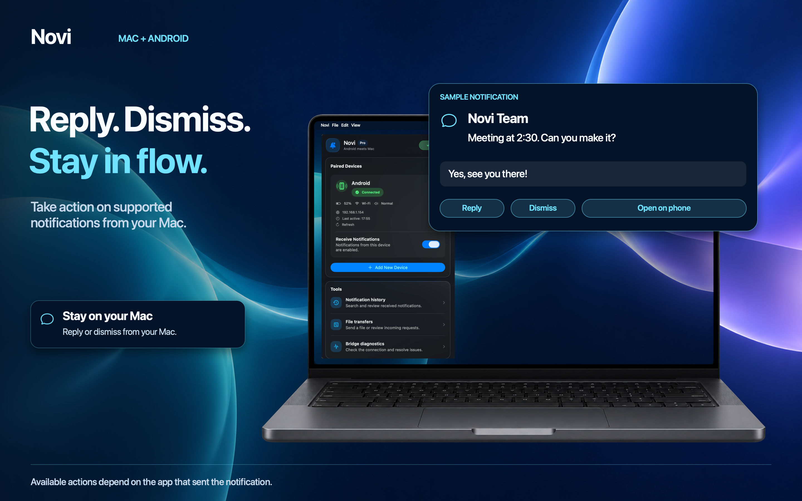</td>
    <td width="50%">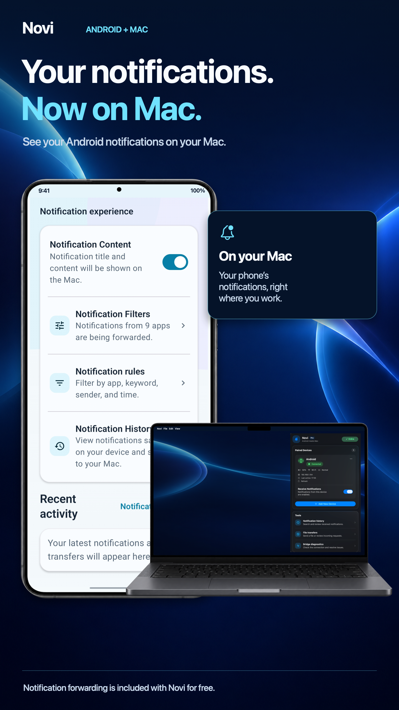</td>
  </tr>
</table>

## Continuity, built for Android and Mac

Novi Pro expands the bridge beyond notifications:

- **Bidirectional file transfer** — Send files from Android to Mac or from Mac to Android over your local network.
- **Clipboard sharing** — Move text between your paired devices when you need it.
- **Phone controls** — Ring, vibrate, silence, and manage supported device states from your Mac.
- **Notification history and filters** — Find what matters and control what reaches your desktop.
- **Smart routines** — Create local, on-device automations that react to notifications and context.
- **Multiple Macs** — Keep independent, encrypted connections for every paired Mac.

<table>
  <tr>
    <td width="50%">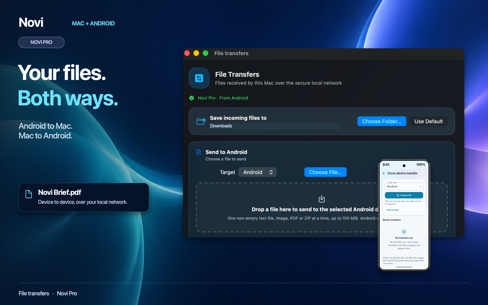</td>
    <td width="50%">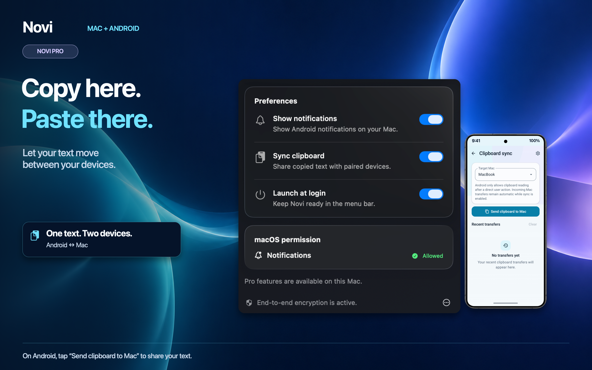</td>
  </tr>
  <tr>
    <td width="50%">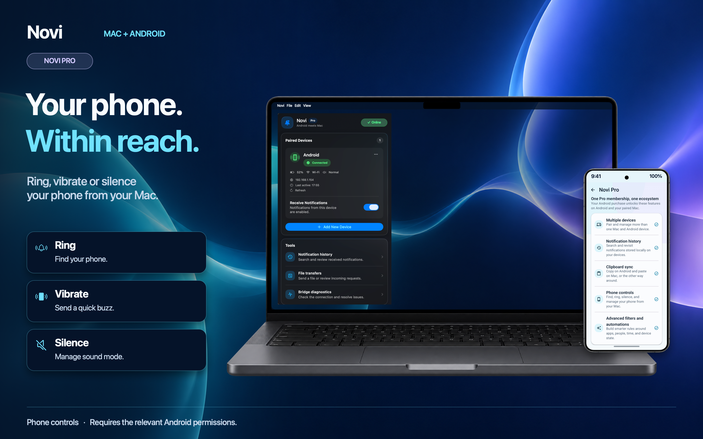</td>
    <td width="50%">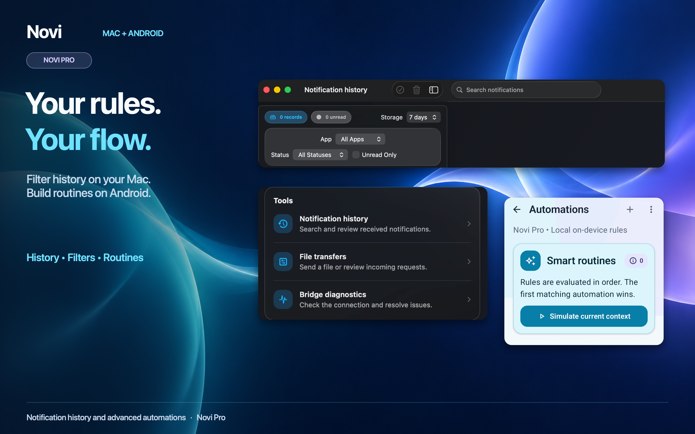</td>
  </tr>
</table>

## Private by architecture

Your notification and continuity data travels directly between your paired devices on the local network. Novi does not operate a notification relay, account service, analytics backend, or remote content archive.

- Encrypted local communication
- TLS with certificate pinning
- AES-256-GCM protected payloads
- HMAC-SHA256 request authentication
- Expiring, single-use QR pairing
- Android Keystore and macOS Keychain protection
- App Sandbox and Hardened Runtime on macOS

  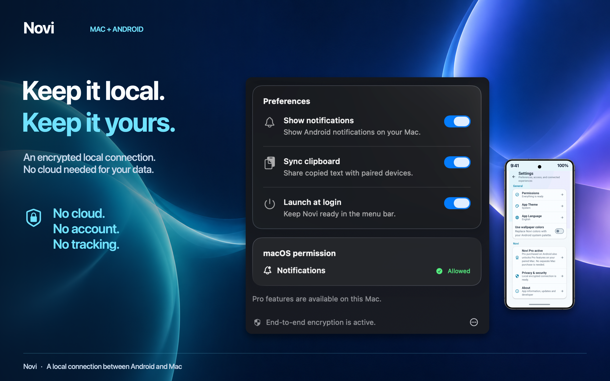

Read the detailed [security architecture](docs/SECURITY.md) and [privacy policy](docs/index.html).

## Free or Pro—start with the bridge

| Novi Free | Novi Pro |
| --- | --- |
| Pair one Android device with one Mac | Pair and manage multiple Macs |
| Mirror Android notifications on macOS | Transfer files in both directions |
| Use supported reply, dismiss, and open actions | Share clipboard text |
| Encrypted local connection | Control supported phone states |
| No account or cloud relay | Search notification history and use advanced filters |
|  | Build smart on-device automations |

Novi Pro is purchased or restored through Google Play on Android. Its entitlement becomes available to paired Macs without a separate Mac purchase.

## See Novi on Android

<table>
  <tr>
    <td width="25%">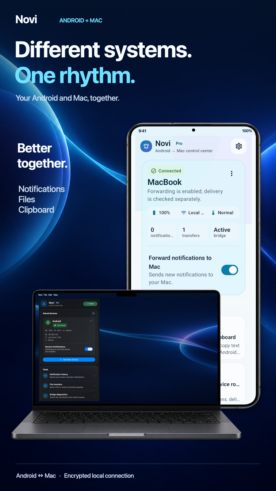</td>
    <td width="25%">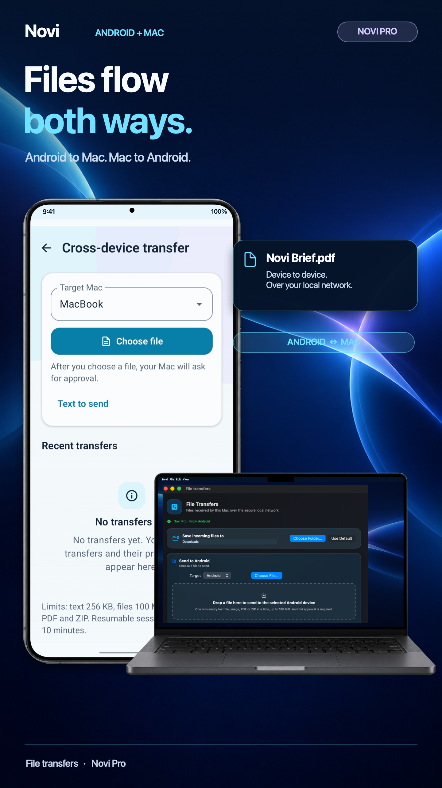</td>
    <td width="25%">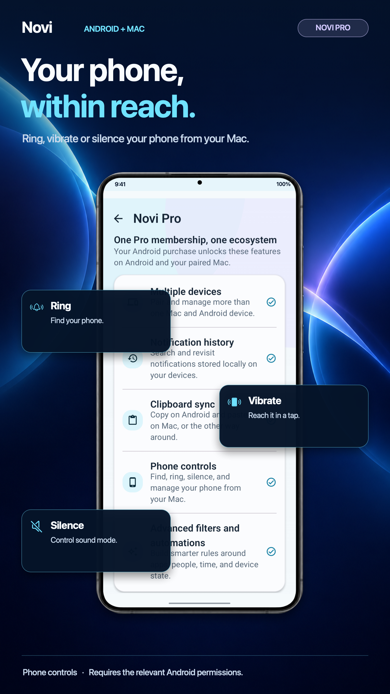</td>
    <td width="25%">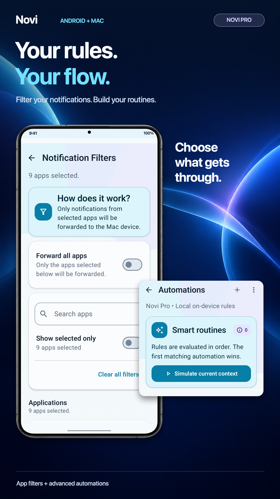</td>
  </tr>
</table>

  
<strong>View the complete Android gallery</strong>

   
  <table>
    <tr>
      <td width="25%"></td>
      <td width="25%"></td>
      <td width="25%">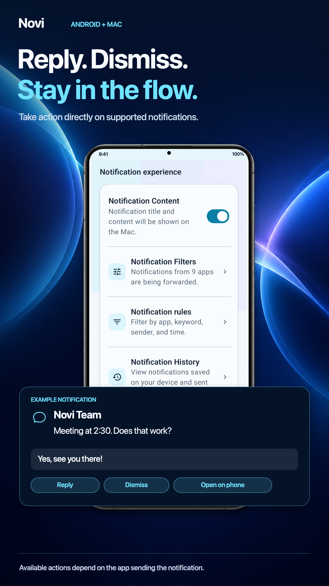</td>
      <td width="25%"></td>
    </tr>
    <tr>
      <td width="25%">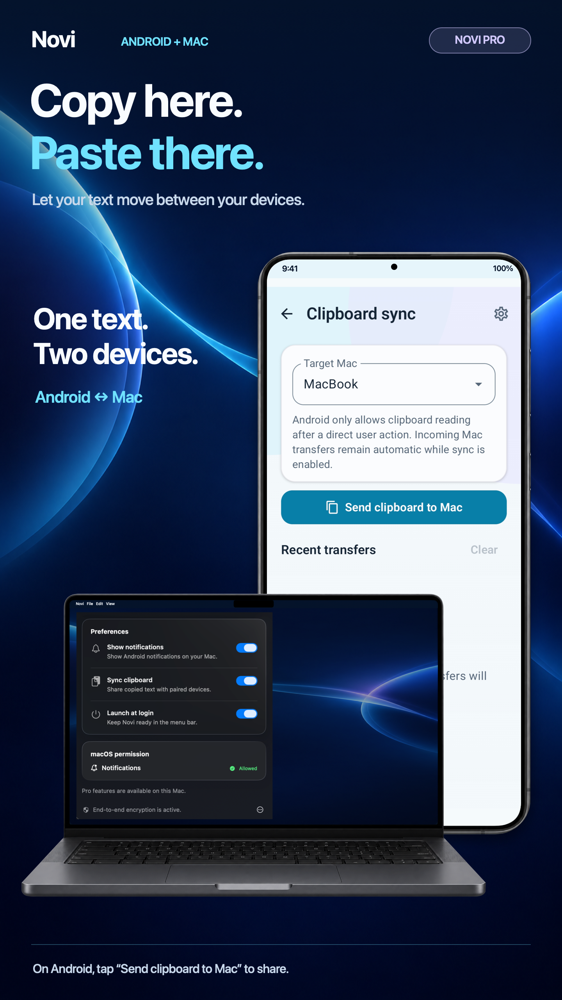</td>
      <td width="25%"></td>
      <td width="25%"></td>
      <td width="25%">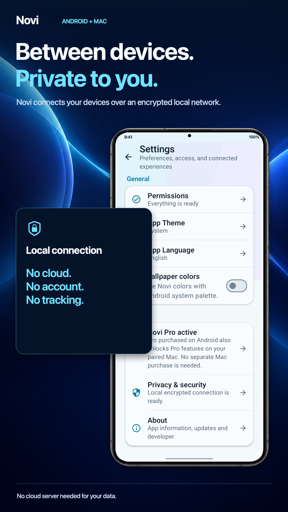</td>
    </tr>
  </table>

  
<strong>View the complete Mac gallery</strong>

   
  <table>
    <tr>
      <td width="50%"></td>
      <td width="50%"></td>
    </tr>
    <tr>
      <td width="50%"></td>
      <td width="50%"></td>
    </tr>
    <tr>
      <td width="50%"></td>
      <td width="50%"></td>
    </tr>
    <tr>
      <td width="50%"></td>
      <td width="50%"></td>
    </tr>
  </table>

## Availability

Novi consists of two native companion apps:

- **Android:** Kotlin and Jetpack Compose, Android 10 or later.
- **Mac:** SwiftUI, distributed through the Mac App Store.

Both devices must be on the same local network for pairing and communication. Feature availability can depend on the originating Android app, Android version, device capabilities, and permissions granted by the user.

## Support and security

Novi is proprietary software and this repository is not an open-source distribution. Public pull requests are not accepted. Product feedback and bug reports are welcome through the official support channels.

Please report security issues privately to [contact@alpwarestudio.com](mailto:contact@alpwarestudio.com). Do not include notification content, pairing secrets, private keys, or other sensitive data.

## AlpWare Studio

Novi is created by **AlpWare Studio**.

- [AlpWare Studio](https://alpwarestudio.com)

---

  <strong>Novi</strong> 
  Android meets Mac. Locally, securely, seamlessly.

Copyright © AlpWare Studio. All rights reserved. Novi is proprietary and closed-source software. See [LICENSE](LICENSE) for details.
